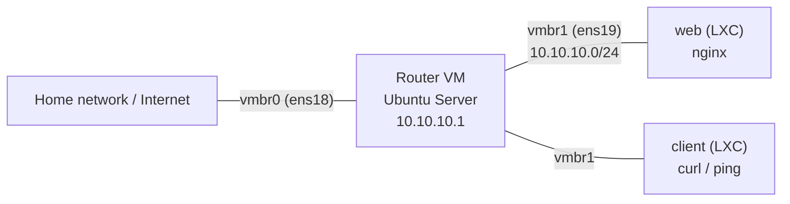

# Proxmox Network Lab

A simulated network built inside Proxmox: an Ubuntu Server router VM provides NAT, DHCP and DNS for an isolated private network, with a web server container and a client container behind it.




## What this demonstrates

- **Virtual networking** with Linux bridges: `vmbr0` for the real network, `vmbr1` as an isolated lab network with no physical port
- **Routing** between two networks using IP forwarding
- **NAT** (masquerade) with nftables so lab machines can reach the internet
- **DHCP and DNS** with dnsmasq
- **Client/server testing** between containers on the private network
- Linux basics: netplan, sysctl, systemd services, SSH and `scp`

## Requirements

| Item | Details |
|---|---|
| Hypervisor | Proxmox VE (9.2.21) |
| Router VM | Ubuntu Server, 1 core, 2 GB RAM, 16 GB disk, 2 network devices |
| Containers | 2x Ubuntu LXC from the Proxmox template library (`web`, `client`) |
| Extra RAM/disk | Roughly 3 GB RAM and 20 GB disk in total for the lab |

## Repo contents

```
configs/
├── proxmox/
│   └── interfaces        # vmbr1 bridge definition (host)
└── router/
    ├── 60-lab.yaml       # netplan: static IP on the LAN interface
    ├── 99-forward.conf   # sysctl: enable IPv4 forwarding
    ├── nftables.conf     # NAT / masquerade rule
    └── lab.conf          # dnsmasq: DHCP and DNS for the LAN
docs/
└── images/               # screenshots and diagram
```

## Quick start

1. **Create the isolated bridge.** In Proxmox: Node > System > Network > Create > Linux Bridge, name it `vmbr1`, leave all fields blank, then Apply Configuration.
2. **Create the router VM** from the Ubuntu Server ISO with two NICs: `vmbr0` (WAN) and `vmbr1` (LAN). Install with OpenSSH server enabled.
3. **Set a static LAN address** on the router by copying `configs/router/60-lab.yaml` to `/etc/netplan/`, then:
   ```bash
   sudo chmod 600 /etc/netplan/60-lab.yaml
   sudo netplan apply
   ```
4. **Enable forwarding:**
   ```bash
   sudo cp configs/router/99-forward.conf /etc/sysctl.d/
   sudo sysctl --system
   ```
5. **Enable NAT:** add the contents of `configs/router/nftables.conf` to `/etc/nftables.conf`, then:
   ```bash
   sudo systemctl enable --now nftables
   ```
6. **Set up DHCP and DNS:**
   ```bash
   sudo apt install -y dnsmasq
   sudo cp configs/router/lab.conf /etc/dnsmasq.d/
   sudo systemctl restart dnsmasq
   ```
7. **Create the `web` and `client` containers** on bridge `vmbr1` with IPv4 set to DHCP.

Interface names (`ens18` for WAN, `ens19` for LAN) may differ on your system. Check with `ip a` and adjust the configs.

## How it works

| Component | Role |
|---|---|
| `vmbr1` | Virtual switch that exists only inside Proxmox, so lab traffic is isolated |
| Router VM | Has one foot in each network. `10.10.10.1` on the LAN side, a home-network address on the WAN side |
| IP forwarding | Lets Linux pass packets between its two network cards instead of only handling its own |
| NAT (nftables) | Rewrites outgoing traffic to look like it comes from the router, since the home network doesn't know about `10.10.10.0/24` |
| dnsmasq | Gives lab machines an address (`10.10.10.100-200`), the router as their gateway, and DNS via `1.1.1.1` |

## Verification

On the router:

```bash
ip -4 addr show ens19                  # should show 10.10.10.1/24
cat /proc/sys/net/ipv4/ip_forward      # should print 1
sudo nft list ruleset                  # should show the masquerade rule
systemctl status dnsmasq               # should be active (running)
```

On the `client` container:

```bash
ping -c 3 10.10.10.1      # reaches the router
ping -c 3 1.1.1.1         # routing and NAT work
curl http://10.10.10.x    # replace with web's IP; returns the nginx page
```

### Results

<!-- Replace with your own screenshots or pasted terminal output -->


## Problems I ran into

<!-- Edit this section to match what actually happened to you. Examples: -->

- **Router VM would not start.** Cause: *network bridge was not applied*.
- ** Multiple ID10T issues** Cause: *Forgetting passwords and usernames created for each device*.

## What I learned

- How to navigate proxmox and created VMs / containers.
- SSH'ing and network capabilities of a container inside a proxmox network
- Basic network forwarding with a 'router'

## Next steps

- [ ] Replace the Ubuntu router with OPNsense or pfSense
- [ ] Create multiple LANs and Routers with multiple services and clients running on each

